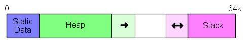

# Teensy 3.x memory model

The memory model for the Teensy 3.x is very simple and is basically divided into 3 sections: static data, heap and stack. Static data is of fixed size for a program and includes things like global variables. Static data is place at the start of ram. The heap is place after the static data and initially has a size of 0 (zero) bytes. Heap is the memory allocate by dynamic allocations, such as the C/C++ commands of new, alloc() and realloc(). When more heap is required, it grows upwards in memory towards the stack. Once memory has been claimed by the heap it is not released. The stack contains things like your local variables. It is effectively upside-down, starting at the very top of ram and growing down towards the heap. Unlike the heap, the stack size grows and srinks, as functions are entered and exited.

